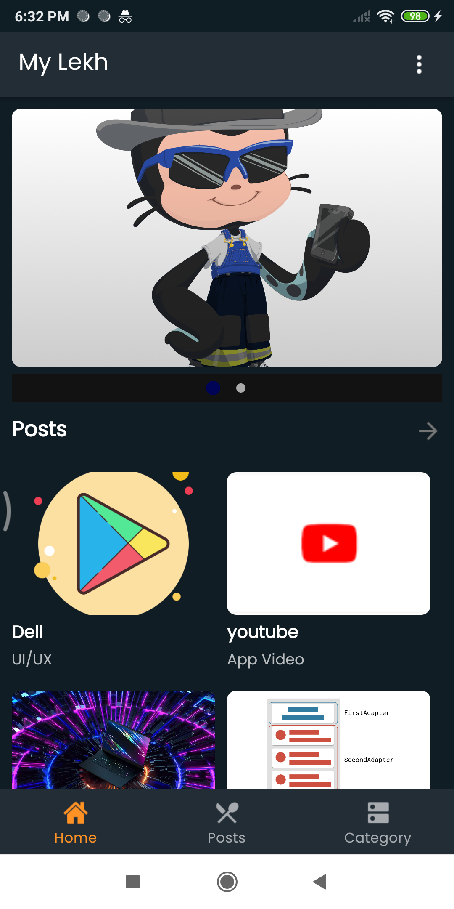
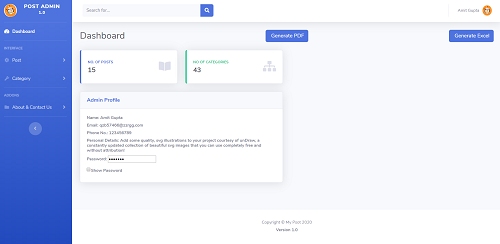

# My Post Android App and Admin Panel

  

## Demo
Android App | Admin Panel
------------ | -------------
 | 

## Android App (version 1.0)
- List Of Post 
- List Of Category 
- List Of Post Category
- Settings

## My Post Admin Panel (version 1.0)
- Login And Register
- Create,Read Update and Delete Posts
- Create,Read Update and Delete Category
- List Of Category
- List OF Posts 
- About And Contact Us
- Generate PDF
- Generate EXCEL File

## Tools 
- Sublime 
- Android Studio 3.6.1

## Langauge
- Java (Android App)
- HTML5
- PHP7
- JS
- AJAX

Enjoy! We're always happy to hear your feedback.

